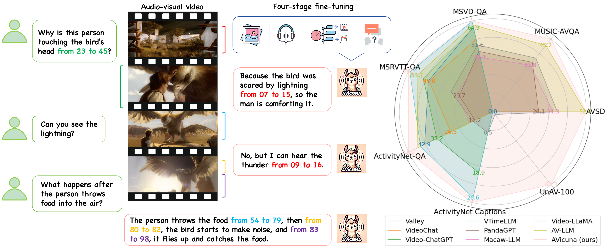
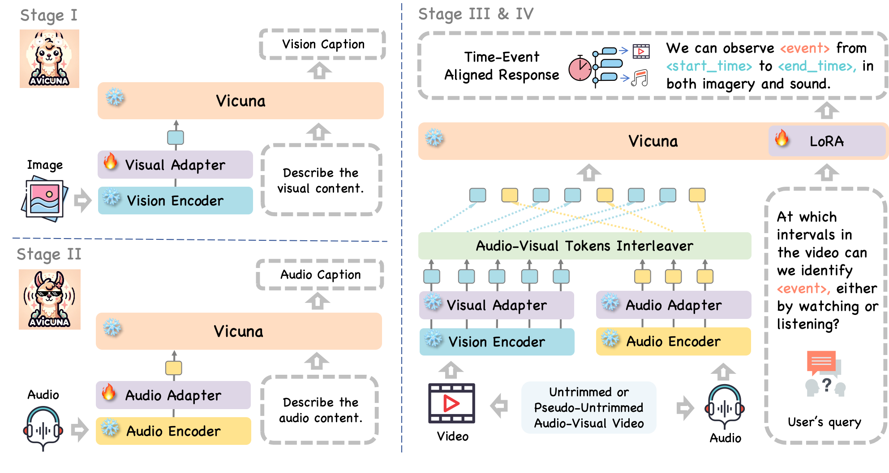

# AVicuna
Repo for the paper ["Empowering LLMs with Pseudo-Untrimmed Videos for Audio-Visual Temporal Understanding"](https://arxiv.org/abs/2403.16276).





---

## Installation

We recommend setting up a conda environment for the project:
```shell
git clone https://github.com/yunlong10/AVicuna.git
cd AVicuna

conda env create -f avicuna.yml
conda activate avicuna
```

## Data & Checkpoints
Download the metadata in JSON [here](https://drive.google.com/drive/folders/1KqdXVtXP8wyYIn6g-AJGeQqX_XS28OOy?usp=sharing) and place them into the `./data` folder.

Download the fine-tuned model's checkpoints [here](https://drive.google.com/drive/folders/1OaU59FW02pgM9iBg2X95x3o4EmlfYhli?usp=sharing) and place them into the `./checkpoints` folder.
```
- data
    - stage1.json
    - stage2.json
    - stage3.json
    - stage4.json

- checkpoints
    - avicuna-vicuna-v1-5-7b-stage1
    - avicuna-vicuna-v1-5-7b-stage2
    - avicuna-vicuna-v1-5-7b-stage3
    - avicuna-vicuna-v1-5-7b-stage4
    - clip
        - ViT-L-14.pt
```


## Inference

```python
python -m avicuna.inference
```

## Features
The video and audio features can be extracted by `./avicuna/get_clip.py` and `./avicuna/get_clap.py`. You can also download the extracted features [here]().


## Training
We train our model on a single NVIDIA A6000 48G GPU.

Stage I: Vision-Text Alignment
```shell
bash scripts/stage1.sh
```

Stage II: Audio-Text Alignment
```shell
bash scripts/stage2.sh
```

Stage III: Time-Event Alignment
```shell
bash scripts/stage3.sh
```

Stage IV: Instruction Tuning
```shell
bash scripts/stage4.sh
```


## Pseudo-Untrimmed Video Construction
Coming soon ...


## Acknowledgements

This work was supported by Sony Group Corporation. We would like to thank Sayaka Nakamura and Jerry Jun Yokono for insightful discussion.


We are also thankful for the following awesome projects our AVicuna arising from:
* [LLaMA](https://github.com/facebookresearch/llama): Open and efficient foundation language models.
* [FastChat](https://github.com/lm-sys/FastChat): An open platform for training, serving, and evaluating large language model based chatbots.
* [Video-ChatGPT](https://github.com/mbzuai-oryx/Video-ChatGPT): Towards detailed video understanding via large vision and language models.
* [Vid2seq](https://github.com/google-research/scenic/tree/main/scenic/projects/vid2seq): Large-scale pretraining of a visual language model for dense video captioning.
* [VTimeLLM](https://github.com/huangb23/VTimeLLM): A Vid-LLM for fine-grained video moment understanding.
* [VALOR-32K](https://github.com/TXH-mercury/VALOR): A audiovisual-language dataset.
* [UnAV-100](https://unav100.github.io): An untrimmed video dataset for dense audio-visual event localization.
* [Auto-ACD](https://auto-acd.github.io): a large-scale dataset for audio-language representation learning.
* [AudioSet](https://research.google.com/audioset/index.html): A large-scale dataset of manually annotated audio events.
* [AudioCap](https://audiocaps.github.io): Towards generating natural language description for any kind of audio in the wild.
* [InternVid](https://github.com/OpenGVLab/InternVideo/tree/main/Data/InternVid): A large-scale video-text dataset.

## Citation


```bibtex
@article{tang2024avicuna,
  title={Empowering LLMs with Pseudo-Untrimmed Videos for Audio-Visual Temporal Understanding},
  author={Tang, Yunlong and Shimada, Daiki and Bi, Jing and Feng, Mingqian and Hua, Hang and Xu, Chenliang},
  journal={arXiv preprint arXiv:2403.16276},
  year={2024}
}
```


